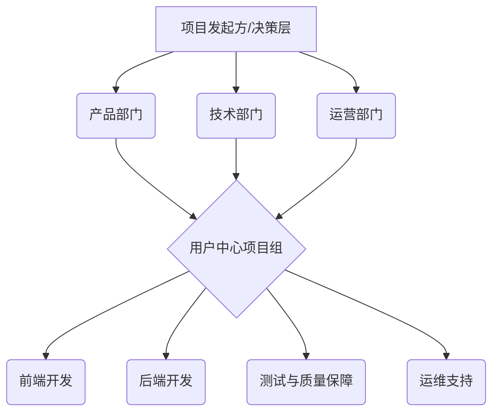
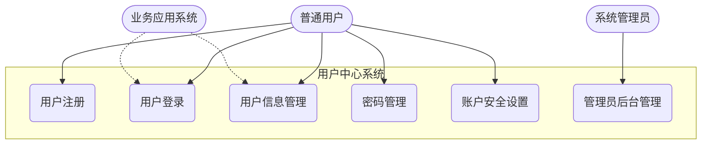
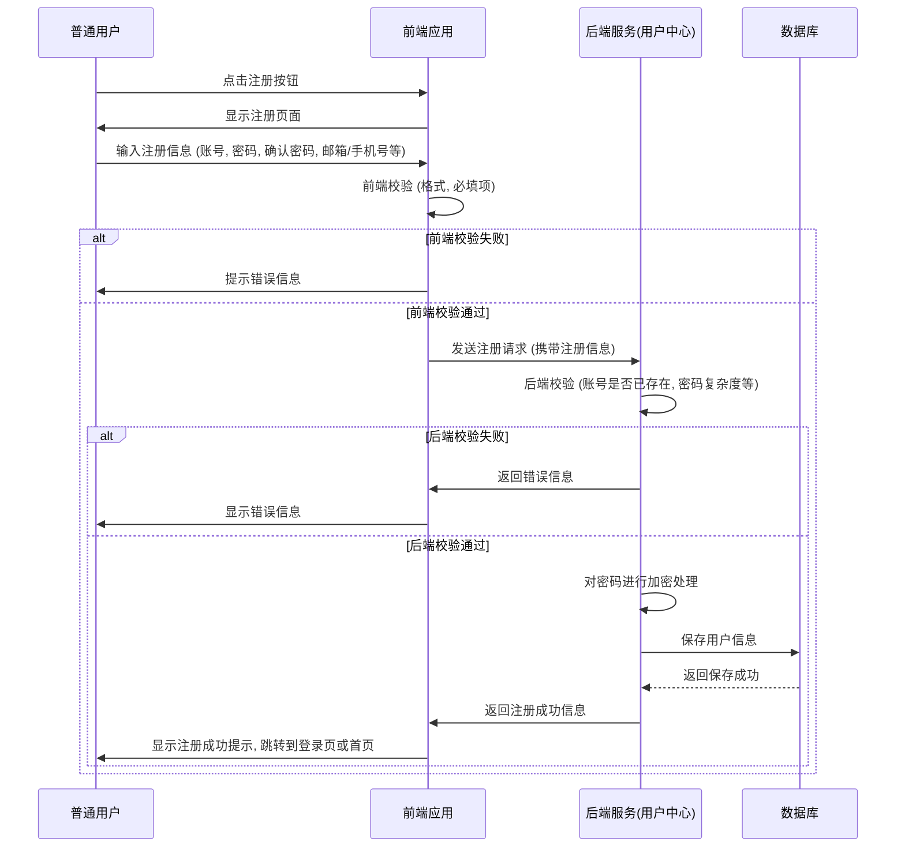
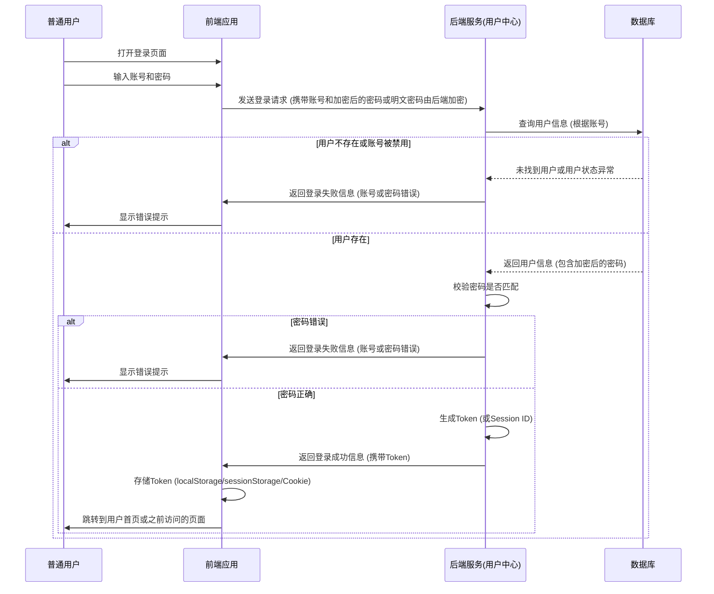
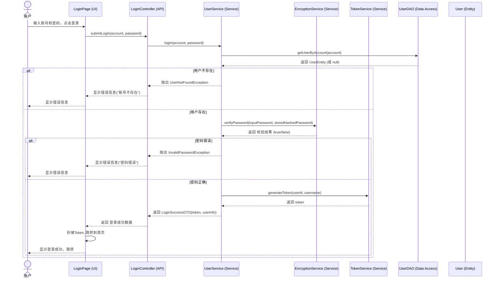
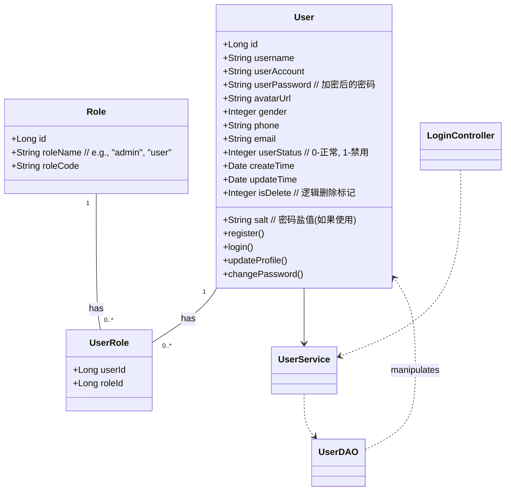
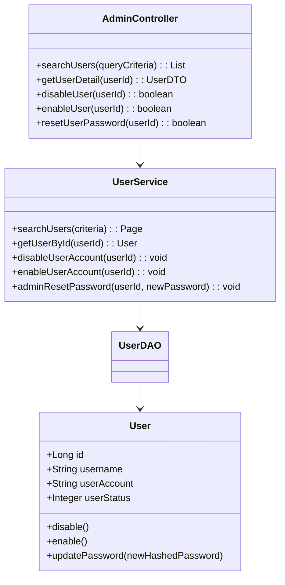

# 用户中心系统设计文档

## 1 系统概述

### 1.1 研究背景及意义

#### 1.1.1 研究背景

随着互联网应用的普及和发展，用户管理成为了各类应用系统的核心组成部分。传统的用户管理方式往往存在效率低下、安全性不足、难以扩展等问题。为了解决这些问题，构建一个独立、通用、高效的用户中心系统变得至关重要。用户中心系统能够统一管理用户信息、认证授权、账户安全等，为上层业务应用提供稳定可靠的用户服务支持。

#### 1.1.2 研究意义

本项目的研究意义在于：

*   **提升开发效率**：通过提供标准化的用户服务接口，减少重复开发用户管理模块的工作量，使开发团队能够更专注于核心业务逻辑的实现。
*   **增强系统安全性**：集中管理用户认证和授权，采用统一的安全策略和加密机制，有效提升系统的整体安全性，防范常见的安全风险。
*   **提高用户体验**：提供统一的登录入口和用户账户管理功能，简化用户操作流程，提升用户体验。
*   **易于扩展和维护**：模块化的设计使得用户中心系统易于扩展新功能和进行后期维护，能够适应不断变化的业务需求。
*   **数据集中管理**：将用户数据集中存储和管理，便于数据分析和挖掘，为业务决策提供数据支持。

### 1.2 核心业务

用户中心系统的核心业务主要包括：

*   **用户注册**：允许新用户创建账户。
*   **用户登录**：验证用户身份，允许用户访问系统。
*   **用户信息管理**：允许用户查看和修改个人信息。
*   **用户账户安全**：包括密码修改、密码找回、账户锁定等功能。
*   **用户权限管理**（可选，根据实际需求）：管理用户在不同业务系统中的访问权限。
*   **第三方登录集成**（可选）：支持通过微信、QQ等第三方平台登录。

### 1.3 系统拟解决的主要问题

本系统旨在解决以下主要问题：

*   **用户身份认证不统一**：各个业务系统独立进行用户认证，导致用户需要在不同系统间重复登录，体验不佳。
*   **用户信息分散管理**：用户信息存储在不同业务系统的数据库中，数据冗余且难以同步，管理成本高。
*   **安全策略不一致**：各业务系统的安全防护水平参差不齐，容易出现安全漏洞。
*   **开发效率低下**：每个新业务系统都需要重复开发用户管理相关功能，浪费开发资源。
*   **扩展性差**：传统的用户管理模块与业务逻辑耦合度高，难以适应快速变化的业务需求。

## 2 需求分析

### 2.1 组织分析

#### 2.1.1 组织目标分析

*   **短期目标**：构建一个稳定、安全、易用的用户中心基础平台，满足当前核心业务的用户管理需求。
*   **中期目标**：逐步将现有业务系统的用户管理功能迁移至统一的用户中心，实现用户数据的集中管理和单点登录。
*   **长期目标**：将用户中心打造成企业级的用户服务中台，为未来新业务的快速孵化提供支撑，并探索基于用户数据的增值服务。

#### 2.1.2 组织机构分析



*   **项目发起方/决策层**：负责项目的整体规划、资源投入和最终决策。
*   **产品部门**：负责需求调研、产品设计、用户体验优化。
*   **技术部门**：负责系统架构设计、技术选型、开发实现和技术支持。
*   **运营部门**：负责系统的日常运营、用户支持和推广。
*   **用户中心项目组**：由各相关部门抽调人员组成，具体负责项目的实施。

#### 2.1.3 组织职能分析

*   **产品经理**：定义用户需求，设计产品功能和交互流程。
*   **架构师**：设计系统整体架构，选择合适的技术栈。
*   **后端工程师**：负责用户中心核心业务逻辑的开发、数据库设计和API接口实现。
*   **前端工程师**：负责用户中心管理界面和用户操作界面的开发。
*   **测试工程师**：负责制定测试计划，执行功能测试、性能测试和安全测试。
*   **运维工程师**：负责系统部署、监控、日常维护和故障处理。

### 2.2 业务用例分析

#### 2.2.1 定义业务边界

用户中心系统的业务边界主要围绕用户账户的生命周期管理以及为其他业务系统提供用户身份认证和信息查询服务。



#### 2.2.2 发现业务参与者

*   **普通用户 (User)**：使用系统的最终用户，进行注册、登录、信息修改等操作。
*   **系统管理员 (Admin)**：负责管理用户账户、配置系统参数、监控系统运行状态等。
*   **业务应用系统 (BizApp)**：依赖用户中心进行用户认证和获取用户信息的其他应用系统。

#### 2.2.3 获取业务用例

*   **普通用户 (User)**：
    *   注册账户
    *   通过账号密码登录
    *   通过手机验证码登录（可选）
    *   通过第三方账号登录（可选）
    *   查看个人信息
    *   修改个人信息（如昵称、头像、联系方式等）
    *   修改密码
    *   找回密码
    *   绑定/解绑手机号
    *   绑定/解绑邮箱
    *   注销账户
*   **系统管理员 (Admin)**：
    *   登录后台管理系统
    *   查询用户信息
    *   禁用/启用用户账户
    *   重置用户密码
    *   管理系统配置参数
    *   查看系统日志
*   **业务应用系统 (BizApp)**：
    *   请求用户身份认证
    *   获取用户信息

#### 2.2.4 业务建模

**用户注册流程：**



**用户登录流程 (账号密码)：**



### 2.3 需求分析

**功能性需求：**

| 模块         | 需求点                                     | 优先级 | 备注                                   |
| ------------ | ------------------------------------------ | ------ | -------------------------------------- |
| **用户注册** | 支持通过用户账号注册                       | 高     | 账号全局唯一                           |
|              | 支持密码加密存储 (如MD5+Salt, BCrypt)      | 高     |                                        |
|              | 注册时校验账号格式、密码复杂度             | 高     |                                        |
|              | 校验账号是否已存在                         | 高     |                                        |
|              | 支持邮箱注册和验证（可选）                 | 中     |                                        |
|              | 支持手机号注册和短信验证（可选）           | 中     |                                        |
| **用户登录** | 支持通过账号密码登录                       | 高     |                                        |
|              | 登录失败次数限制及账户锁定机制             | 高     | 防止暴力破解                           |
|              | 支持生成和验证Token (如JWT)                | 高     | 用于后续接口访问认证                   |
|              | 支持单点登录 (SSO) （可选，远期）        | 低     |                                        |
|              | 支持手机验证码登录（可选）                 | 中     |                                        |
|              | 支持第三方账号登录（如微信、QQ）（可选）   | 中     |                                        |
| **用户信息管理** | 用户可以查看自己的基本信息                 | 高     | 如用户名、头像、注册时间等             |
|              | 用户可以修改自己的昵称、头像等             | 高     |                                        |
|              | 用户可以绑定/解绑手机号（如果支持）        | 中     |                                        |
|              | 用户可以绑定/解绑邮箱（如果支持）          | 中     |                                        |
| **密码管理** | 用户可以修改密码                           | 高     | 需要验证旧密码                         |
|              | 用户可以通过邮箱/手机号找回密码            | 高     |                                        |
| **账户安全** | 支持查看登录历史（可选）                   | 中     |                                        |
|              | 支持设置安全问题（可选）                   | 低     |                                        |
| **管理员后台** | 管理员可以查询用户列表                     | 高     | 支持按条件筛选                         |
|              | 管理员可以查看用户详情                     | 高     |                                        |
|              | 管理员可以禁用/启用用户账户                | 高     |                                        |
|              | 管理员可以重置用户密码                     | 高     |                                        |
|              | 管理员可以管理系统配置（如密码策略）       | 中     |                                        |
|              | 操作日志记录                               | 高     | 记录关键操作，便于审计和追溯           |

**非功能性需求：**

*   **安全性**：
    *   密码必须加密存储，不可逆。
    *   防止常见的Web攻击，如XSS、CSRF、SQL注入等。
    *   敏感数据传输使用HTTPS。
    *   接口访问进行权限校验。
*   **性能**：
    *   注册、登录等核心操作响应时间应在1秒以内。
    *   系统应能支持至少 [具体数值，如1000] 并发用户访问。
*   **可用性**：
    *   系统应保证高可用性，例如99.9%的在线时间。
    *   关键数据应有备份和恢复机制。
*   **可扩展性**：
    *   系统架构应易于水平扩展，以应对未来用户量的增长。
    *   功能模块应低耦合，易于添加新功能或集成其他系统。
*   **易用性**：
    *   用户界面应简洁明了，操作流程应符合用户习惯。
    *   管理员后台操作应便捷高效。
*   **可维护性**：
    *   代码结构清晰，注释完整。
    *   提供完善的日志记录，便于问题排查。

## 3 系统分析

### 3.1 建立系统用例

```mermaid
left to right direction
actor 普通用户 as User
actor 系统管理员 as Admin
actor 业务应用 as BizApp

rectangle 用户中心系统 {
  User -- (注册)
  User -- (登录)
  User -- (查看个人信息)
  User -- (修改个人信息)
  User -- (修改密码)
  User -- (找回密码)
  User -- (注销账户)

  Admin -- (管理用户)
  Admin -- (管理系统配置)
  Admin -- (查看日志)

  BizApp -- (请求用户认证)
  BizApp -- (获取用户信息)

  (注册) .> (密码加密) : include
  (登录) .> (密码校验) : include
  (登录) .> (生成Token) : include
  (修改密码) .> (验证旧密码) : include
  (管理用户) ..> (查询用户) : extends
  (管理用户) ..> (禁用/启用用户) : extends
  (管理用户) ..> (重置用户密码) : extends
}
```

**用例描述 (示例：用户注册)：**

*   **用例名称**：用户注册
*   **参与者**：普通用户
*   **前置条件**：用户未登录系统。
*   **基本流程**：
    1.  用户访问注册页面。
    2.  用户输入用户名、密码、确认密码等注册信息。
    3.  系统校验用户输入信息的合法性（如用户名是否已存在、密码复杂度是否符合要求、两次输入的密码是否一致）。
    4.  如果校验失败，系统提示相应的错误信息。
    5.  如果校验成功，系统对用户密码进行加密处理。
    6.  系统将用户信息保存到数据库。
    7.  系统返回注册成功提示，并引导用户登录。
*   **扩展流程/异常流程**：
    *   3a. 用户名已存在：系统提示“用户名已被注册”。
    *   3b. 密码不符合复杂度要求：系统提示“密码过于简单”。
    *   3c. 两次输入的密码不一致：系统提示“两次输入的密码不一致”。
    *   6a. 数据库保存失败：系统记录错误日志，并提示用户“注册失败，请稍后重试”。
*   **后置条件**：用户账户创建成功，用户信息已存入数据库。

### 3.2 分析业务规则

*   **用户账号规则**：
    *   用户账号在系统中必须是唯一的。
    *   用户账号长度限制：例如，最小4个字符，最大20个字符。
    *   用户账号字符限制：例如，只能包含字母、数字、下划线。
*   **密码规则**：
    *   密码最小长度：例如，8个字符。
    *   密码复杂度要求：例如，必须包含大写字母、小写字母、数字、特殊字符中的至少三种。
    *   密码不能与用户账号相同。
    *   新密码不能与最近N次使用过的旧密码相同（可选）。
*   **登录尝试规则**：
    *   连续登录失败N次（例如5次）后，账户将被临时锁定M分钟（例如30分钟）。
    *   账户锁定期间，用户无法登录。
*   **Token/Session规则**：
    *   Token/Session具有有效期，过期后需要重新登录。
    *   Token应包含足够的信息以识别用户，但不应包含敏感信息。
*   **用户信息修改规则**：
    *   修改敏感信息（如密码、手机号、邮箱）时，可能需要进行二次验证（如输入旧密码、短信验证码）。

### 3.3 用例实现

以“用户登录”用例为例，进行简要的实现分析：

**参与对象 (分析类)：**

*   **边界类 (Boundary Class)**：
    *   `LoginPage` (前端登录页面)
    *   `LoginController` (后端API接口，接收登录请求)
*   **控制类 (Control Class)**：
    *   `UserService` (处理用户相关的业务逻辑，如校验用户、生成Token)
    *   `EncryptionService` (负责密码的加密和校验)
    *   `TokenService` (负责Token的生成和解析)
*   **实体类 (Entity Class)**：
    *   `User` (用户数据模型，对应数据库中的用户表)

**序列图 (Sequence Diagram) - 登录实现：**



### 3.4 软件架构和框架

本项目采用**微服务架构**（如果适用，对于独立用户中心可能采用单体分层架构更常见）或**分层架构**。

**技术栈选型 (基于Java Spring Boot的示例)：**

*   **后端框架**：Spring Boot
*   **数据持久层**：Spring Data JPA / MyBatis-Plus
*   **数据库**：MySQL / PostgreSQL
*   **缓存**：Redis (用于存储Token、验证码、热点用户信息等)
*   **密码加密**：Spring Security (BCryptPasswordEncoder)
*   **Token方案**：JWT (Java JWT library)
*   **API文档**：SpringDoc (OpenAPI 3)
*   **日志框架**：SLF4J + Logback
*   **构建工具**：Maven / Gradle
*   **前端框架**（如果包含管理后台）：Vue.js / React + Ant Design / Element UI

**分层架构图 (示例)：**

```mermaid
graph TD
    subgraph 用户中心应用
        A[展现层 (Presentation Layer)] <--> B(应用层/服务层 (Application/Service Layer))
        B <--> C(领域层 (Domain Layer))
        C <--> D(基础设施层 (Infrastructure Layer))
    end

    A --- E(用户界面 / API接口)
    B --- F(业务逻辑处理 - UserService)
    C --- G(领域模型 - User Entity, Value Objects)
    D --- H(数据库交互 - UserDAO/Repository)
    D --- I(外部服务调用 - 短信服务, 邮件服务)
    D --- J(缓存 - Redis)

    E --> A
    F --> B
    G --> C
    H --> D
    I --> D
    J --> D
```

*   **展现层 (Presentation Layer)**：负责处理用户请求和响应，例如Spring MVC的Controller。提供API接口给前端或其他服务调用。
*   **应用层/服务层 (Application/Service Layer)**：编排领域对象完成业务用例，处理业务逻辑。例如`UserService`。
*   **领域层 (Domain Layer)**：包含核心业务逻辑和业务规则，定义领域实体（Entity）、值对象（Value Object）等。例如`User`实体。
*   **基础设施层 (Infrastructure Layer)**：提供通用的技术能力支持，如数据库访问、缓存操作、消息队列、第三方服务集成等。例如DAO/Repository接口的实现、Redis客户端等。

### 3.5 建立分析模型

分析模型主要关注系统中的核心实体及其关系，以及关键业务流程中的对象交互。

#### 3.5.1 用户“注册登录”的分析模型

**类图 (Class Diagram) - 核心实体和关系：**



**说明：**

*   `User`类：核心用户实体，包含用户的基本信息、账户信息、状态等。
*   `Role`类：角色实体，用于权限管理（如果系统需要）。
*   `UserRole`类：用户和角色的关联表实体。
*   `UserService`：处理用户相关的业务逻辑。
*   `UserDAO` (或 `UserRepository`)：负责用户数据的持久化操作。
*   `LoginController`：处理登录相关的HTTP请求。

#### 3.5.2 管理员“用户管理”的分析模型

**类图 (Class Diagram) - 管理员操作相关：**



**说明：**

*   `AdminController`：处理管理员后台关于用户管理的HTTP请求。
*   `UserService`：提供管理员操作用户账户的方法，如查询、禁用、启用、重置密码等。
*   这些操作最终会调用`UserDAO`来更新数据库中的`User`实体信息。

## 4 系统设计

### 4.1 设计模型

设计模型是在分析模型的基础上，进一步细化类的职责、接口和协作方式，使其更接近于最终的实现代码。

#### 4.1.1 实体分析类映射到设计类

分析模型中的实体类（如`User`, `Role`）通常会直接映射到设计模型中的实体类，并可能增加一些持久化相关的注解（如JPA的`@Entity`, `@Table`, `@Id`, `@Column`等）或ORM框架的特定配置。

**User实体设计示例 (JPA)：**

```java
import javax.persistence.*;
import java.util.Date;

@Entity
@Table(name = "user") // 假设数据库表名为 user
public class User {

    @Id
    @GeneratedValue(strategy = GenerationType.IDENTITY)
    private Long id;

    @Column(nullable = false, unique = true, length = 50)
    private String username; // 用户昵称

    @Column(nullable = false, unique = true, length = 50)
    private String userAccount; // 登录账号

    @Column(nullable = false, length = 128)
    private String userPassword; // 加密后的密码

    @Column(length = 255)
    private String avatarUrl;

    private Integer gender; // 0-女, 1-男

    @Column(length = 20)
    private String phone;

    @Column(length = 100)
    private String email;

    @Column(nullable = false, columnDefinition = "INT default 0")
    private Integer userStatus; // 0-正常, 1-禁用

    @Temporal(TemporalType.TIMESTAMP)
    @Column(nullable = false, updatable = false, columnDefinition = "TIMESTAMP DEFAULT CURRENT_TIMESTAMP")
    private Date createTime;

    @Temporal(TemporalType.TIMESTAMP)
    @Column(nullable = false, columnDefinition = "TIMESTAMP DEFAULT CURRENT_TIMESTAMP ON UPDATE CURRENT_TIMESTAMP")
    private Date updateTime;

    @Column(nullable = false, columnDefinition = "INT default 0")
    private Integer isDelete; // 逻辑删除标记 0-未删除, 1-已删除

    // Getters and Setters...
}
```

#### 4.1.2 控制分析类映射到设计类

分析模型中的控制类（如`UserService`）会映射到设计模型中的服务类。这些服务类通常会定义清晰的接口和实现。

**UserService接口设计示例：**

```java
import com.yupi.usercenter.model.domain.User;
import com.yupi.usercenter.model.dto.UserRegisterRequest;
import com.yupi.usercenter.model.dto.UserLoginRequest;

public interface UserService {

    /**
     * 用户注册
     * @param userRegisterRequest 注册请求体
     * @return 新用户 id
     */
    long userRegister(UserRegisterRequest userRegisterRequest);

    /**
     * 用户登录
     * @param userLoginRequest 登录请求体
     * @param request HttpServletRequest 用于获取session
     * @return 脱敏后的用户信息 和 token
     */
    User userLogin(UserLoginRequest userLoginRequest, HttpServletRequest request);

    /**
     * 用户信息脱敏
     * @param originUser 原始用户对象
     * @return 脱敏后的用户对象
     */
    User getSafetyUser(User originUser);

    /**
     * 用户注销
     * @param request HttpServletRequest
     * @return 1 表示成功
     */
    int userLogout(HttpServletRequest request);

    // ... 其他管理员操作方法，如查询用户、禁用用户等
    // Page<User> searchUsers(UserQueryRequest queryRequest);
    // boolean disableUser(long userId);
    // boolean enableUser(long userId);
    // boolean resetPassword(long userId, String newPassword);
}
```

**UserServiceImpl 实现类 (部分示例)：**

```java
import org.springframework.stereotype.Service;
import org.springframework.util.DigestUtils; // 假设使用MD5简单示例
import javax.annotation.Resource;
import javax.servlet.http.HttpServletRequest;
// ... 其他导入

@Service
public class UserServiceImpl implements UserService {

    @Resource
    private UserMapper userMapper; // 假设使用MyBatis-Plus的Mapper

    // 盐值，实际项目中应该更复杂且每个用户不同，或使用BCrypt等自带盐值的算法
    private static final String SALT = "yupi";

    @Override
    public long userRegister(UserRegisterRequest userRegisterRequest) {
        String userAccount = userRegisterRequest.getUserAccount();
        String userPassword = userRegisterRequest.getUserPassword();
        String checkPassword = userRegisterRequest.getCheckPassword();

        // 1. 校验 (非空、账户长度、密码长度、特殊字符、密码一致性、账户是否已存在等)
        // ... 此处省略详细校验逻辑，实际应非常严谨
        if (StringUtils.isAnyBlank(userAccount, userPassword, checkPassword)) {
            throw new BusinessException(ErrorCode.PARAMS_ERROR, "参数为空");
        }
        // ... 更多校验

        // 2. 密码加密
        String encryptedPassword = DigestUtils.md5DigestAsHex((SALT + userPassword).getBytes());

        // 3. 插入数据
        User user = new User();
        user.setUserAccount(userAccount);
        user.setUserPassword(encryptedPassword);
        // ... 设置其他默认值
        boolean saveResult = this.save(user); // 假设继承了IService<User>
        if (!saveResult) {
            throw new BusinessException(ErrorCode.SYSTEM_ERROR, "注册失败，数据库错误");
        }
        return user.getId();
    }

    @Override
    public User userLogin(UserLoginRequest userLoginRequest, HttpServletRequest request) {
        String userAccount = userLoginRequest.getUserAccount();
        String userPassword = userLoginRequest.getUserPassword();

        // 1. 校验 (非空等)
        // ...

        // 2. 查询用户
        QueryWrapper<User> queryWrapper = new QueryWrapper<>();
        queryWrapper.eq("userAccount", userAccount);
        User user = userMapper.selectOne(queryWrapper);
        if (user == null) {
            throw new BusinessException(ErrorCode.PARAMS_ERROR, "用户不存在");
        }

        // 3. 校验密码
        String encryptedPassword = DigestUtils.md5DigestAsHex((SALT + userPassword).getBytes());
        if (!encryptedPassword.equals(user.getUserPassword())) {
            throw new BusinessException(ErrorCode.PARAMS_ERROR, "密码错误");
        }

        // 4. 用户信息脱敏
        User safetyUser = getSafetyUser(user);

        // 5. 记录用户登录态 (例如使用Session或生成JWT Token)
        request.getSession().setAttribute("userLoginState", safetyUser);
        // 或者: String token = jwtTokenUtil.generateToken(safetyUser);
        // return new LoginResponse(safetyUser, token);

        return safetyUser;
    }

    @Override
    public User getSafetyUser(User originUser) {
        if (originUser == null) {
            return null;
        }
        User safetyUser = new User();
        safetyUser.setId(originUser.getId());
        safetyUser.setUsername(originUser.getUsername());
        safetyUser.setUserAccount(originUser.getUserAccount());
        safetyUser.setAvatarUrl(originUser.getAvatarUrl());
        safetyUser.setGender(originUser.getGender());
        safetyUser.setPhone(originUser.getPhone());
        safetyUser.setEmail(originUser.getEmail());
        safetyUser.setUserStatus(originUser.getUserStatus());
        safetyUser.setCreateTime(originUser.getCreateTime());
        // safetyUser.setUserRole(originUser.getUserRole()); // 如果有角色信息
        return safetyUser;
    }
    // ...
}
```

#### 4.1.3 边界分析类映射到设计类 (选作)

分析模型中的边界类（如`LoginController`）会映射到设计模型中的Controller类，负责接收HTTP请求，调用服务层处理业务逻辑，并返回响应。

**LoginController设计示例 (Spring MVC)：**

```java
import org.springframework.web.bind.annotation.*;
import javax.annotation.Resource;
import javax.servlet.http.HttpServletRequest;
// ... 其他导入

@RestController
@RequestMapping("/user")
public class UserController { // 通常命名为 UserController

    @Resource
    private UserService userService;

    @PostMapping("/register")
    public BaseResponse<Long> userRegister(@RequestBody UserRegisterRequest userRegisterRequest) {
        if (userRegisterRequest == null) {
            throw new BusinessException(ErrorCode.PARAMS_ERROR);
        }
        long result = userService.userRegister(userRegisterRequest);
        return ResultUtils.success(result);
    }

    @PostMapping("/login")
    public BaseResponse<User> userLogin(@RequestBody UserLoginRequest userLoginRequest, HttpServletRequest request) {
        if (userLoginRequest == null) {
            throw new BusinessException(ErrorCode.PARAMS_ERROR);
        }
        User user = userService.userLogin(userLoginRequest, request);
        return ResultUtils.success(user);
    }

    @PostMapping("/logout")
    public BaseResponse<Integer> userLogout(HttpServletRequest request) {
        if (request == null) {
            throw new BusinessException(ErrorCode.PARAMS_ERROR);
        }
        int result = userService.userLogout(request);
        return ResultUtils.success(result);
    }

    @GetMapping("/current")
    public BaseResponse<User> getCurrentUser(HttpServletRequest request) {
        Object userObj = request.getSession().getAttribute("userLoginState");
        User currentUser = (User) userObj;
        if (currentUser == null) {
            throw new BusinessException(ErrorCode.NOT_LOGIN_ERROR);
        }
        // 可以考虑从数据库重新获取最新信息，防止session中数据陈旧
        long userId = currentUser.getId();
        User user = userService.getById(userId);
        User safetyUser = userService.getSafetyUser(user);
        return ResultUtils.success(safetyUser);
    }
    // ... 其他接口，如获取当前用户信息等
}
```

### 4.2 接口设计

接口设计主要关注系统对外提供的API。采用RESTful API风格。

**用户相关API：**

*   `POST /api/user/register`：用户注册
    *   Request Body: `{ "userAccount": "string", "userPassword": "string", "checkPassword": "string", ... }`
    *   Response: `{ "code": 0, "data": userId, "message": "ok" }`
*   `POST /api/user/login`：用户登录
    *   Request Body: `{ "userAccount": "string", "userPassword": "string" }`
    *   Response: `{ "code": 0, "data": { "user": { ... }, "token": "string" }, "message": "ok" }` (如果使用JWT)
*   `POST /api/user/logout`：用户登出
    *   Response: `{ "code": 0, "data": null, "message": "ok" }`
*   `GET /api/user/current`：获取当前登录用户信息
    *   Response: `{ "code": 0, "data": { ...user info... }, "message": "ok" }`
*   `PUT /api/user/profile`：修改用户个人信息
    *   Request Body: `{ "username": "string", "avatarUrl": "string", ... }`
    *   Response: `{ "code": 0, "data": null, "message": "ok" }`
*   `PUT /api/user/password`：修改密码
    *   Request Body: `{ "oldPassword": "string", "newPassword": "string", "checkNewPassword": "string" }`
    *   Response: `{ "code": 0, "data": null, "message": "ok" }`

**管理员相关API (示例，通常有权限控制)：**

*   `GET /api/admin/users`：查询用户列表 (支持分页和条件查询)
    *   Query Params: `page=1&size=10&username=xxx&status=0`
    *   Response: `{ "code": 0, "data": { "records": [ ...users... ], "total": 100 }, "message": "ok" }`
*   `GET /api/admin/users/{userId}`：获取用户详情
*   `PUT /api/admin/users/{userId}/disable`：禁用用户
*   `PUT /api/admin/users/{userId}/enable`：启用用户
*   `POST /api/admin/users/{userId}/reset-password`：重置用户密码

### 4.3 包设计

根据分层架构，典型的Java项目包结构如下：

```
com.yupi.usercenter
├── common                    // 通用工具类、常量、枚举、自定义异常、返回结果封装
│   ├── constant
│   ├── enums
│   ├── exception
│   └── model                 // (或放在根model下) BaseResponse, PageRequest等
├── config                    // 配置类 (如Spring Security配置, Mybatis Plus配置, Redis配置)
├── controller                // 控制器层 (Spring MVC Controllers)
├── model                     // 数据模型层
│   ├── domain                // 数据库实体 (Entity/PO)
│   ├── dto                   // 数据传输对象 (DTO, Request/Response模型)
│   └── vo                    // 视图对象 (VO, 通常用于前端展示)
├── mapper                    // 数据访问层接口 (MyBatis Mappers)
├── service                   // 业务逻辑层接口
│   └── impl                  // 业务逻辑层实现
├── utils                     // 工具类 (如加密工具, Token工具, 日期工具等)
├──aop                       // 切面编程 (如日志切面, 权限校验切面)
├── job                       // 定时任务
└── UserCenterApplication.java  // Spring Boot 启动类
```

### 4.4 数据库设计

**用户表 (user)：**

| 字段名         | 数据类型      | 长度 | 是否为空 | 主键 | 外键 | 索引 | 默认值             | 备注                       |
| -------------- | ------------- | ---- | -------- | ---- | ---- | ---- | ------------------ | -------------------------- |
| id             | BIGINT        |      | NOT NULL | PK   |      |      | AUTO_INCREMENT     | 用户ID，主键自增           |
| username       | VARCHAR       | 50   | NULL     |      |      |      |                    | 用户昵称                   |
| userAccount    | VARCHAR       | 50   | NOT NULL |      |      | UNI  |                    | 登录账号，唯一             |
| userPassword   | VARCHAR       | 128  | NOT NULL |      |      |      |                    | 加密后的密码               |
| avatarUrl      | VARCHAR       | 255  | NULL     |      |      |      |                    | 用户头像地址               |
| gender         | TINYINT       |      | NULL     |      |      |      |                    | 性别 (0-女, 1-男, 2-未知)  |
| phone          | VARCHAR       | 20   | NULL     |      |      | IDX  |                    | 手机号码，可加唯一索引     |
| email          | VARCHAR       | 100  | NULL     |      |      | IDX  |                    | 电子邮箱，可加唯一索引     |
| userStatus     | INT           |      | NOT NULL |      |      | IDX  | 0                  | 用户状态 (0-正常, 1-禁用)  |
| createTime     | DATETIME      |      | NOT NULL |      |      |      | CURRENT_TIMESTAMP  | 创建时间                   |
| updateTime     | DATETIME      |      | NOT NULL |      |      |      | CURRENT_TIMESTAMP ON UPDATE CURRENT_TIMESTAMP | 更新时间                   |
| isDelete       | TINYINT       |      | NOT NULL |      |      | IDX  | 0                  | 逻辑删除标记 (0-未删除, 1-已删除) |

**ER图 (Mermaid 格式)：**

```mermaid
erDiagram
    USER {
        BIGINT id PK
        VARCHAR username
        VARCHAR userAccount UK
        VARCHAR userPassword
        VARCHAR avatarUrl
        TINYINT gender
        VARCHAR phone "nullable, index"
        VARCHAR email "nullable, index"
        INT userStatus "default 0, index"
        DATETIME createTime
        DATETIME updateTime
        TINYINT isDelete "default 0, index"
    }

    ROLE {
        BIGINT id PK
        VARCHAR roleName UK
        VARCHAR roleCode UK
        DATETIME createTime
        DATETIME updateTime
    } 

    USER_ROLE {
        BIGINT userId FK
        BIGINT roleId FK
        PRIMARY KEY (userId, roleId)
    }

    USER ||--o{ USER_ROLE : "has roles"
    ROLE ||--o{ USER_ROLE : "assigned to users"
```
*注：`ROLE` 和 `USER_ROLE` 表是可选的，如果系统需要精细的权限管理则添加。*

## 5 系统实现技术建议

*   **后端技术栈**：
    *   **语言**：Java (推荐 LTS 版本，如 Java 11 或 Java 17)
    *   **框架**：Spring Boot (最新稳定版)
    *   **持久层**：MyBatis-Plus (简化CRUD) 或 Spring Data JPA。
    *   **数据库**：MySQL 8.x 或 PostgreSQL。
    *   **缓存**：Redis (用于存储Session/Token，热点数据，验证码等)。
    *   **密码加密**：使用 Spring Security 提供的 `BCryptPasswordEncoder`，它自带盐值处理且安全性较高。
    *   **API认证**：JWT (JSON Web Token) 是一个不错的选择，无状态，易于扩展。可以使用 `jjwt`库。
    *   **API文档**：SpringDoc (基于 OpenAPI 3) 自动生成API文档，方便前后端协作。
    *   **日志**：SLF4J + Logback/Log4j2 进行日志记录。
    *   **单元测试**：JUnit 5 + Mockito。
*   **前端技术栈** (如果包含管理后台或用户界面)：
    *   **框架**：Vue.js (如 Vue 3 + Vite) 或 React。
    *   **UI组件库**：Element Plus (Vue) / Ant Design Vue / Ant Design (React)。
    *   **HTTP请求库**：Axios。
    *   **状态管理**：Pinia (Vue) / Redux Toolkit (React)。
*   **开发工具与环境**：
    *   **IDE**：IntelliJ IDEA (后端), VS Code (前端)。
    *   **版本控制**：Git, GitLab/GitHub/Gitee。
    *   **构建工具**：Maven 或 Gradle。
    *   **容器化**：Docker (便于部署和环境一致性)。
    *   **持续集成/持续部署 (CI/CD)**：Jenkins, GitLab CI/CD。
*   **安全建议**：
    *   **HTTPS**：全站启用HTTPS确保数据传输安全。
    *   **输入校验**：严格校验所有用户输入，防止XSS、SQL注入等。
    *   **参数化查询**：使用预编译语句或ORM框架防止SQL注入。
    *   **权限控制**：对API接口进行严格的权限校验，确保用户只能访问其授权的资源。
    *   **错误处理**：统一的错误处理机制，不暴露敏感的系统错误信息给用户。
    *   **依赖库安全**：定期扫描项目依赖，更新存在漏洞的库。
    *   **操作日志**：记录关键操作日志，便于审计和问题追踪。
*   **部署建议**：
    *   推荐使用Linux服务器进行部署。
    *   使用Docker容器化部署，便于管理和迁移。
    *   如果并发量较大，可以考虑使用Nginx作为反向代理和负载均衡。
    *   数据库和缓存服务建议独立部署，并进行适当的性能优化和安全加固。

通过上述技术选型和建议，可以构建一个健壮、安全、可扩展的用户中心系统。